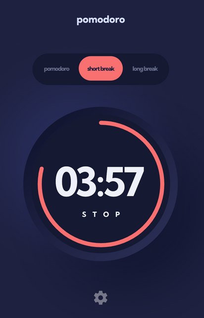
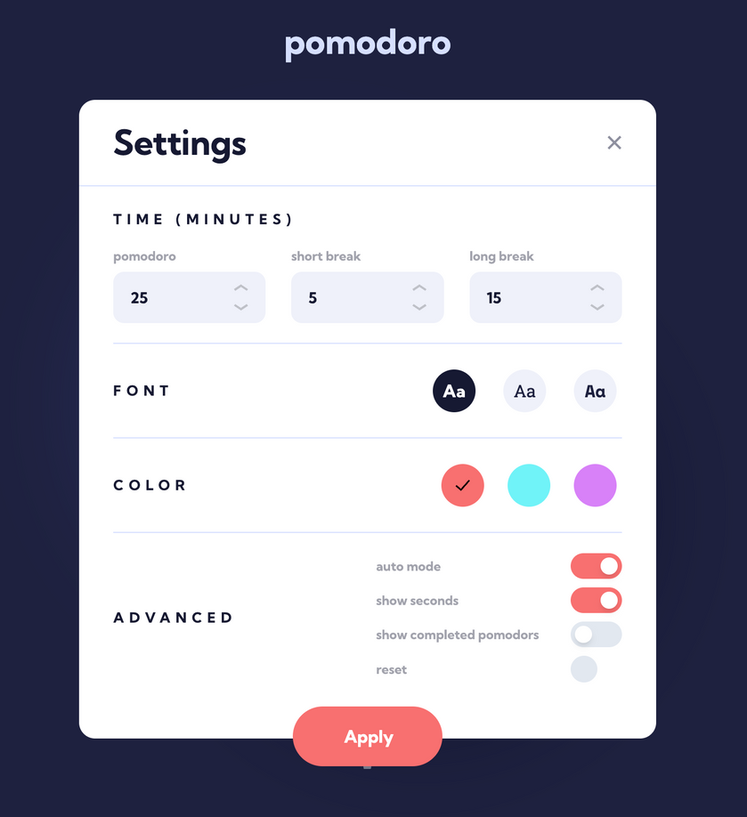

# ⏱️ Pomodoro Timer App

A sleek and customizable Pomodoro timer that lets users manage their focus sessions with adjustable work and break durations. Includes font and color personalization settings, as well as a circular progress bar.

🔗 **Live Demo**: [https://pomodoro-app-three.vercel.app](https://pomodoro-app-three.vercel.app)

---

## 🧱 Tech Stack

- Vue 3 + Vite  
- TypeScript  
- Composition API (`<script setup>`)  
- CSS Variables for theming

---

## 📱 Responsive Previews

| Desktop                     | Mobile                     | Settings Panel             |
|----------------------------|----------------------------|----------------------------|
|     |      |    |

---

## ✨ Features

- Adjustable Pomodoro, short break, and long break times
- Theme customization: fonts and colors
- Circular progress animation
- Fully responsive across devices

---

## 🛠️ Project Setup

```bash
yarn install
yarn dev
```

### Build for Production

```bash
yarn build
```
